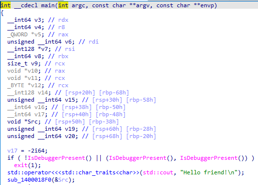
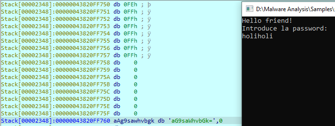
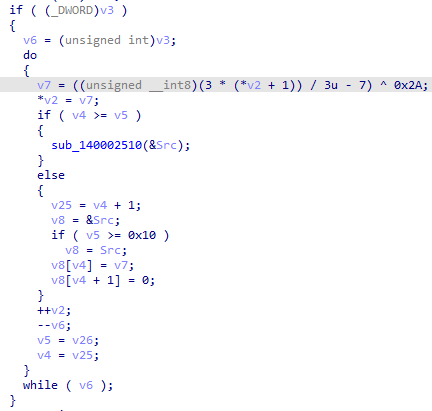
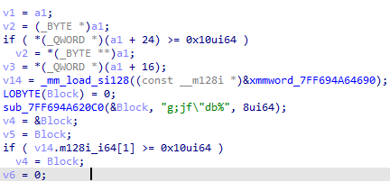
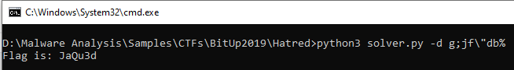

# BitUp 19 - Hatred Writeup

> Consigue la password y utilízala como la flag. Ejemplo: bitup19{password}

> MD5 del Adjunto: 93e148bfcd31ce731674354b28823511

> Agradecimientos a Mrp314 por su colaboración con este reto.

## Solution

### Base64 encoding

First, we open the binary in IDA and we decompile the main function. By looking at the decompiled function it's easy to see that it's a C++ binary because it uses `std::cout`. 

In order to run the binary, we have to patch the first comparison because either we debug the file or not, it will end the execution.

After debugging a little more, we observe that the function `sub_1400018F0` reads the user input and encodes it to Base64:

### XOR encoding

The function `sub_140001C50` encodes the Base64 with a modified XOR algorithm:

If we look into the function we can notice it's comparing the XOR encoded value with a hardcoded string which is the flag encoded:

If the encrypted value matches `g;jf"db%` we get the good boy message:

### Python Script

At last, I coded a simple [Python script](solver.py) to extract the password char by char.

