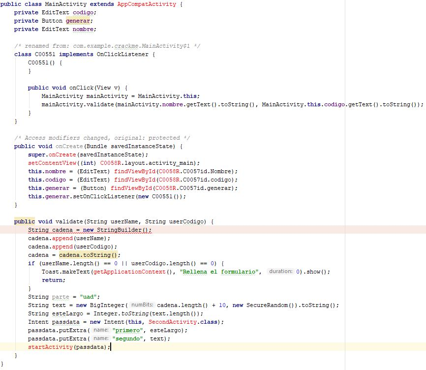
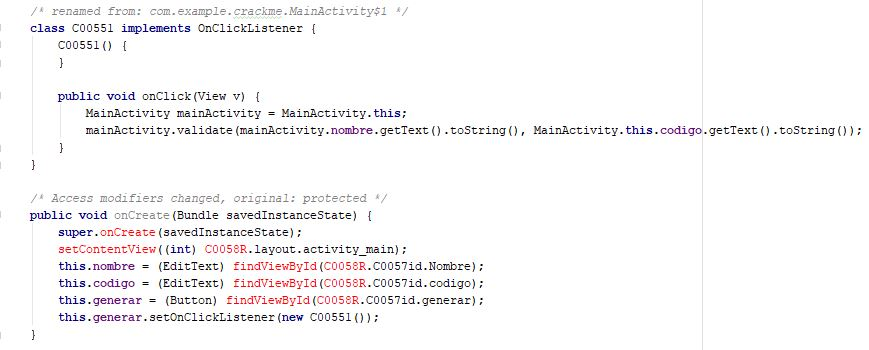
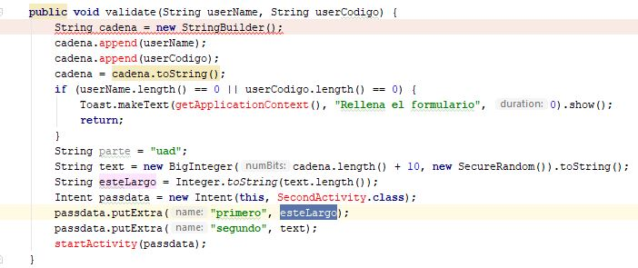
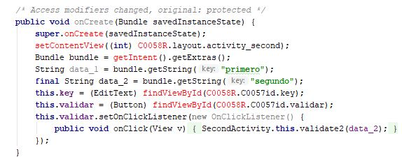
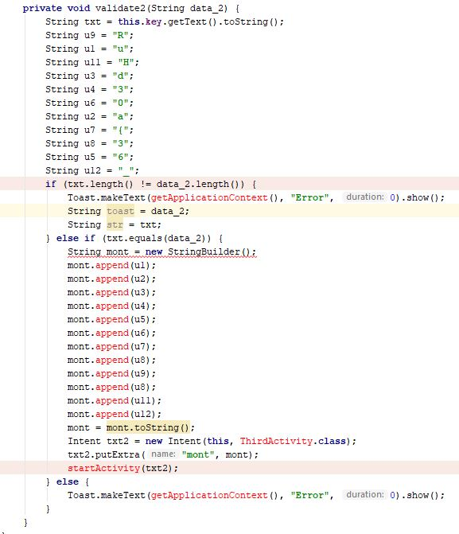
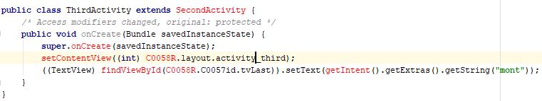
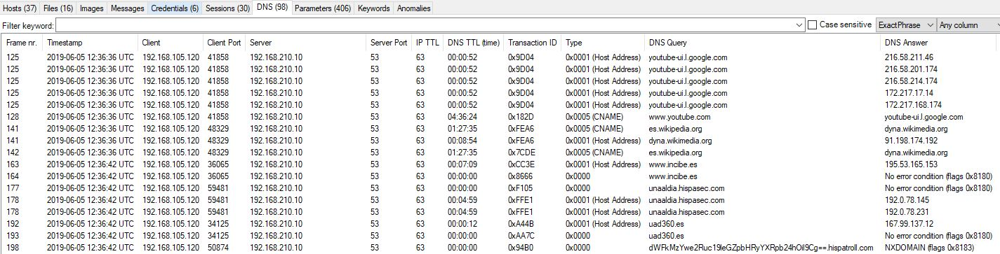

# CTF UAD360 - Writeups
## Reversing
### Go4Fun

> En la vida, unas veces se gana, otras se aprende.
> Descarga: http://descargas.hispasec.com/dpua/go4fun.uu

Pending writeup

### Abduscan

> Archivo: http://descargas.hispasec.com/dpua/main

Pending writeup

### Super Safe Web

> Hemos guardado la flag en una web, pero usamos la ultima tecnología y es imposible que la consigas.
> ¡Ni lo intentes!
> Archivos: http://descargas.hispasec.com/dpua/rev1.zip

As we can see in the extension of the index.wasm file, this is a WebAssembly challenge. First we will use [WABT: The WebAssembly Binary Toolkit](https://github.com/WebAssembly/wabt) to decompile the wasm to a wat file in order to analyze the code statically.


Since we will have to debug the webpage we set a python webserver with this command:
```shell
python -m SimpleHTTPServer
```
We load the page and we see a textbox and a button to check the flag:


We setup a breakpoint in the check_flag function of the wasm module in the Chrome DevTools:


The first thing we can see is that in this function, the first argument is a pointer to memory where the user input is stored and the second one is the length.


If the length is not 20 the program sets the local64 and returns the message "not_the_flag":


Then if the chek is passed, it gets the first letter of the user input and is checked against the value 119 which is 'w' in ASCII.


So if we get all the constant values in decimal and we convert them to ASCII we get the following chars:


If we reorder the chars to w3b455embly_15_funny we can see that this is the flag:


### Dummies

> Warmup.
> Archivo: http://descargas.hispasec.com/dpua/4_6034838764990235951.apk

First we go to Android Studio and we decompile the APK, in order to debug it more easily we add the sources to the project. The first Activity we check is the MainActivity.



We can see that there are two editText and a Button. The Button implements a OnClickListener which calls the validate function.



The validate function receives the username and the usercode and generates a BigInteger with those. Then it starts the SecondActivity with the BigInteger as one argument and its length as second argument.



In this second Activity we have one EditText named key and another Button in order to validate this key.



When we click the button, the validate2 function gets called with the key provided by the user and checks if its length and its value is the same as the BigInteger from the MainActivity. If all checks are OK, it starts the ThirdActivity.



This third activity only sets the layout of the activity and prints the first part of the flag.



So, what we have to do to pass the check is put a Breakpoint in the validate function of the MainActivity in order to know the value of the BigInteger and enter it as the key in the second activity.

After passing the check, the flag appears in the screen: 
`uad360{3R3H_Un_M4Qu1N4}`

## MISC
### Nuevos Horizontes

> Todos los días aprendes algo nuevo... ¡Incluso lenguajes! La contraseña del zip la tienes aquí mismo...
> Ethol rhasswo'hrd ethoos hirestristestigrestomantrigoenuntrigik
> Archivo: http://descargas.hispasec.com/dpua/flag.zip

We realize that the last word of the password looks like a typical spanish tongue twister.
So we use the password "trestristestigrestomantrigoenuntrigal" to decrypt de ZIP.


And we get the flag: 
`uad360{Str4ng3_L4ngu4g3s_4r3_0P}`

## Crypto
### Easy Crypto

> Dicen que utilizan password para encodear esto. ¿Tú que crees?
>jav360{N1C3B3I3_1WH_34SQ_O1J}

Since it says that we need a password to decode the flag, the first cipher that comes to mind is Vigenere.
So we used Cyberchef, and knowing that the first three letters are "uad" we bruteforced it and we get the first three chars from the key are "pas".


Knowing the first three letters, the first word we think could be the key is "password" so we try it in Cyberchef and it worked.


The flag is: 
`uad360{V1G3N3R3_1TS_34SY_W1N}`

### Recursive

> Large Base64 string

We copy the Base64 string into [CyberChef](https://gchq.github.io/CyberChef/#recipe=Label('decrypt')From_Base64('A-Za-z0-9%2B/%3D',true)Jump('decrypt',33)) and we create a Base64 decode loop with a maximum of 33 iterations.

After all the decoding, the flag is: 
`uad360{B64_1S_4LW4YS_B64}`

## Forensics
### Chivatazo

> ¿Quién es?
> Archivo: http://descargas.hispasec.com/dpua/soyyo.pcapng

We open the PCAP with Network Miner and in the DNS tab we find a strange petition wich seems to be Base64 encoded.



We copy the text of the subdomain and we decode with [CyberChef](https://gchq.github.io/CyberChef/#recipe=From_Base64('A-Za-z0-9%2B/%3D',true)&input=ZFdGa016WXdlMlJ1YzE5bGVHWnBiSFJ5WVhScGIyNGhPaWw5Q2c9PQ)

And the flag is: 
`uad360{dns_exfiltration!:)}`

## Web
### Chips Ahoy!

> Una página estática puede dar más información de la que crees...
> http://retos.hispasec.com/uad360/chips_ahoy/

We inspect the response headers with Chrome DevTools and we see a new cookie set by the server.


This cookie changes for every petition but it keeps repeating itself. We recover all the pieces, order them and decode them with [CyberChef](https://gchq.github.io/CyberChef/#recipe=From_Base64('A-Za-z0-9%2B/%3D',true)&input=ZFdGa016WXdlMU16VURSU05GUXpSRjlETURCTE1UTlRYekZUWDA0d1ZGOVRNME5WVWpOOQ)

After decoding it, we get the flag: 
`uad360{S3P4R4T3D_C00K13S_1S_N0T_S3CUR3}`
