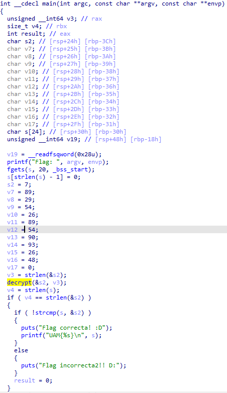

# Una al mes - Dragon ball Episodio 3 Writeup

> Después de que Jacu investigara el servidor de la empresa Capsule Corp con la ayuda del Dr.Brief, las sospechas de Trunks quedaron confirmadas. La existencia de un fichero sospechoso que no ha sido creado por nadie de la empresa, parece indicar que ésta ha sido comprometida. Para aclarar el enigma, el Dr.Brief pide a Bulma que estudie el fichero en cuestión y extraiga cualquier información relevante que pudiera arrojar luz sobre el caso. Bulma consigue obtener la información de su creador, el Dr. Raichi, y descubre, además, que el contenido del fichero está escrito en una extraña lengua de la raza Tsufur. Para descifrar el contenido y obtener el texto en un lenguaje que ellos comprendan necesitan una clave. ¿Podrás encontrarla?

> Descarga del fichero: https://drive.google.com/file/d/1Uihvl5nEjkarfM03DV8J5RgJ2ZD1zy_T/view?usp=sharing

> Info: La flag tiene el formato UAM{md5 del string encontrado}

## Static Analysis Solution

### False flag
First, we open the binary in IDA and we see it has the debugging symbols:

By looking at `main` it is simple to see it has an encrypted buffer, a decrypt function and a `strcmp` with the decrypted buffer.

The decryption function is only a XOR with the key 0x69, if we try to decrypt the buffer with [Cyberchef](https://gchq.github.io/CyberChef/#recipe=Find_/_Replace(%7B'option':'Simple%20string','string':';'%7D,'',true,false,true,false)From_Decimal('Line%20feed',false)XOR(%7B'option':'Hex','string':'69'%7D,'Standard',false)&input=NzsKODk7CjI5Owo1NDsKMjY7Cjg5Owo1NDsKOTA7CjkzOwoyNjsKNDg7) we get `n0t_s0_34sY` which is a false flag.

### VM and hooking engine

If we pay attention to other function names it looks like it could be a virtual machine. If we look into `xd::Run()` we see that the VM has six instructions (MOVRR, MOVRV, CMP_EQ, JMP_NEQ, JMP and XOR).

There's also the function `vector:vector` which searches for software breakpoints in the `.text` section and if it finds six or more it skips the hooking functionality, this is a typical anti-debug trick. In the last line we can see the function hooking the `strcmp` pointer to a function called `malloc` which is not the real memory allocator.

Decompiling the function `malloc` we get what seems to be the VM code.

Looking at the opcodes of the VM with more detail we can see a repeating pattern (Opcodes 51, 68, 105 and 136):

Knowing that 51 calls `xd::do_CMP_EQ` and does a comparision, 136 calls `xd::do_XOR` and performs a XOR, we can infer the first comparison with 11 is checking the length of the flag and after that it xors each byte of the flag with some value and compares it with another hardcoded value.

So if we extract the values after the opcode 51 and the values after the opcode 136, and we xor them we will get the value that satisfies all conditions:

I used a short Python script to automate the XOR operation, I saved the script in the `solver.py` file.
If we check this value in the challenge we can see it works:

Finally, if we calculate the MD5 hash of `G0T_h00k1ng` we get the flag:

`UAM{7b02cd3d2d3cea80359cf600799413d3}`

## Angr Solution

Assuming you're lazy to reverse the full VM code (like me sometimes), you can use Angr to get automagically the flag.

Just keep in mind that the buffer in stdin has to be 12 bytes long because the program overwrites the last byte with the NULL byte.

We set the find and avoid addresses and we're good to go:

After we execute angr with Python we get the value `G0T_h00k1ng` which is the same we got in the static solution:

## IDA Script

In the `solver.py` file I also wrote an IDA Script to extract the values of the flag from the VM code and automatically get the flag:

